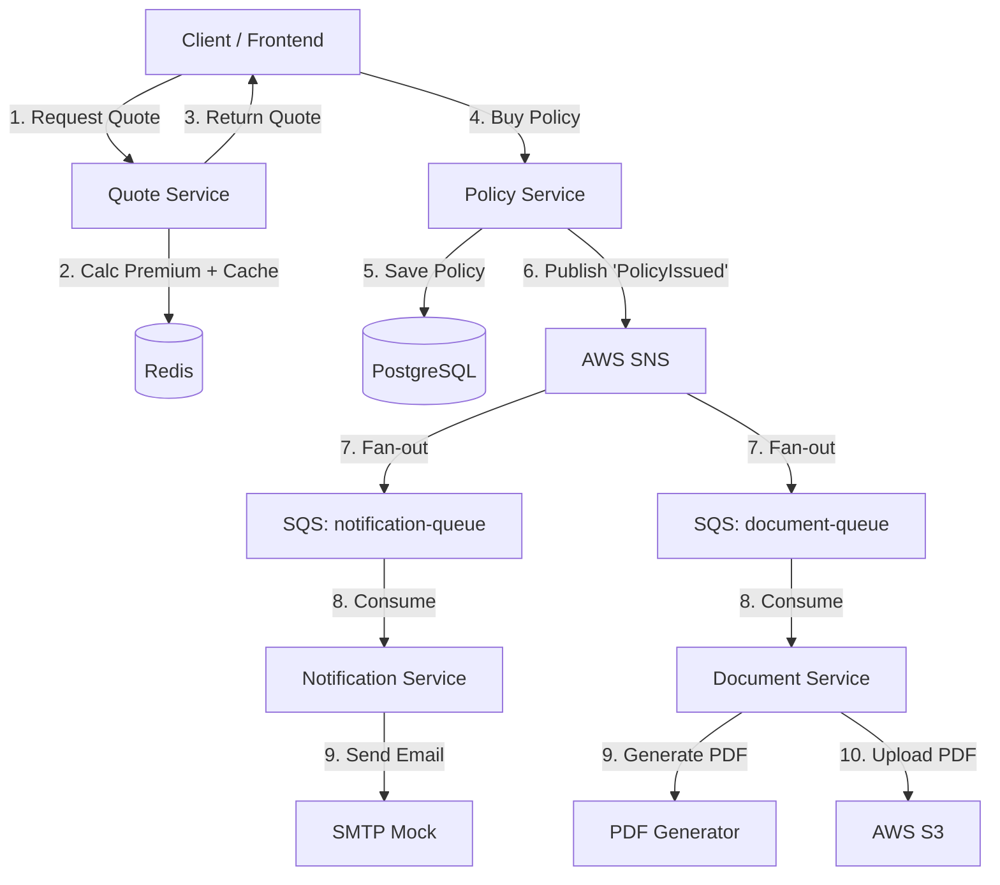

# InsureCloud

Modern, cloud-native Insurance Policy Management Platform built with **Java 21**, **Spring Boot 3.4**, and **AWS** services (emulated via LocalStack).

## 🚀 Overview

InsureCloud is a microservices-based system designed to handle the full lifecycle of insurance policies. It demonstrates professional software engineering practices, including Event-Driven Architecture, Domain-Driven Design (DDD), and Infrastructure as Code (IaC).

## 🛠 Tech Stack

- **Languages:** Java 21
- **Framework:** Spring Boot 3.4
- **Persistence:** PostgreSQL, DynamoDB, Redis
- **Infrastructure:** Docker Compose, LocalStack (S3, SQS, SNS)
- **Search:** Elasticsearch
- **Testing:** JUnit 5, Mockito, Testcontainers
- **API:** OpenAPI (Swagger)

## 🏗 Architecture

The system consists of several autonomous microservices:
- **Policy Service:** Manages policy lifecycle and issuance.
- **Quote Engine:** Calculates premiums based on risk factors.
- **Notification Service:** Handles asynchronous communication with customers.
- **Document Service:** Generates and stores PDF policy documents.

### System Flow Diagram


## 🚦 Getting Started

### Prerequisites
- Docker & Docker Compose
- JDK 21
- Maven 3.9+

### Running Infrastructure
To start the local cloud environment (Postgres, LocalStack, etc.):
```bash
docker compose up -d
```

### Running Services
Navigate to a service directory and run:
```bash
mvn spring-boot:run
```

## 📈 API Documentation
Once the services are running, you can access the Swagger UI:
- Policy Service: `http://localhost:8081/swagger-ui.html`

## 📝 License
This project is licensed under the MIT License.
