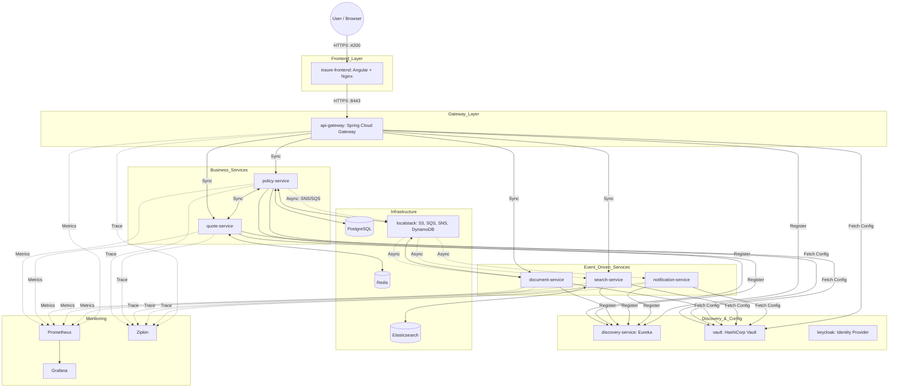

# InsureCloud

Modern, cloud-native Insurance Policy Management Platform built with **Java 21**, **Spring Boot 3.4**, and **AWS** services (emulated via LocalStack).

## 🚀 Overview

InsureCloud is a microservices-based system designed to handle the full lifecycle of insurance policies. It demonstrates professional software engineering practices, including Event-Driven Architecture, Domain-Driven Design (DDD), and Infrastructure as Code (IaC).

## 🛠 Tech Stack

- **Languages:** Java 21 (with **Virtual Threads** enabled)
- **Framework:** Spring Boot 3.4
- **API Gateway:** Spring Cloud Gateway
- **Discovery:** Netflix Eureka (Secured with Basic Auth)
- **Security:** Keycloak (OAuth2 / OpenID Connect)
- **Resilience:** Resilience4j (Circuit Breaker, Fallback)
- **Validation:** Jakarta Validation
- **Persistence:** PostgreSQL, DynamoDB (Audit Log), Redis
- **Secret Management:** HashiCorp Vault
- **Infrastructure:** Docker Compose, LocalStack (S3, SQS, SNS, DynamoDB, SES)
- **Search:** Elasticsearch
- **Observability:** Prometheus, Grafana, Micrometer Tracing (Zipkin)
- **Testing:** JUnit 5, Mockito, Testcontainers, WireMock
- **API:** OpenAPI (Swagger)

## 🏗 Architecture & Request Flow

The system utilizes a centralized **API Gateway**, **Service Discovery**, and an **Identity Provider (Keycloak)** to ensure secure, resilient, and manageable communication. While a **Zero-Trust** security model is implemented (JWT/RBAC), for **development purposes, security has been simplified (permitAll)** to allow immediate testing and exploration without complex authentication steps. Secrets and sensitive configurations are managed centrally via **HashiCorp Vault**.

### Microservices Architecture & Request Flow Diagram

```mermaid
graph TD
    User((User / Browser))
    
    subgraph Frontend_Layer
        IF[insure-frontend: Angular + Nginx]
    end
    
    subgraph Gateway_Layer
        AG[api-gateway: Spring Cloud Gateway]
    end
    
    subgraph Discovery_&_Config
        ED[discovery-service: Eureka]
        HV[vault: HashiCorp Vault]
        KC[keycloak: Identity Provider]
    end
    
    subgraph Business_Services
        PS[policy-service]
        QS[quote-service]
    end
    
    subgraph Event_Driven_Services
        DS[document-service]
        SS[search-service]
        NS[notification-service]
    end
    
    subgraph Infrastructure
        PDB[(PostgreSQL)]
        RDB[(Redis)]
        ES[(Elasticsearch)]
        LS[localstack: S3, SQS, SNS, DynamoDB]
    end
    
    subgraph Monitoring
        PR[Prometheus]
        GR[Grafana]
        ZP[Zipkin]
    end

    User -->|HTTPS :4200| IF
    IF -->|HTTPS :8443| AG
    
    AG -->|Sync| PS
    AG -->|Sync| QS
    AG -->|Sync| SS
    AG -->|Sync| DS
    
    PS <-->|Sync| QS
    PS <--> LS
    PS <--> PDB
    
    QS <--> RDB
    
    PS -.->|Async: SNS/SQS| LS
    LS -.->|Async| DS
    LS -.->|Async| SS
    LS -.->|Async| NS
    
    DS <--> LS
    SS <--> ES
    
    %% Discovery & Config
    PS & QS & DS & SS & NS & AG -->|Register| ED
    PS & QS & DS & SS & NS & AG -->|Fetch Config| HV
    
    %% Monitoring
    PS & QS & DS & SS & NS & AG -.->|Metrics| PR
    PS & QS & DS & SS & NS & AG -.->|Trace| ZP
    PR --> GR
```

## 🚦 Getting Started

### Prerequisites
- Docker & Docker Compose
- JDK 21
- Maven 3.9+

### Building the Project
Build all microservices at once from the root directory:
```bash
mvn clean package -DskipTests
```

### Running the Entire System
You can launch the full environment (Infrastructure + Microservices) with a single command:
```bash
docker compose up -d --build
```

### Verification & Testing

#### 1. Obtain a Security Token (Optional)
While security is currently set to `permitAll`, the infrastructure for Keycloak is fully functional. You can obtain a JWT token using the provided helper script:

- **For Insurance Agent:** `./get-token.sh` (or `./get-token.sh AGENT`)
- **For Admin:** `./get-token.sh ADMIN`
- **For Customer:** `./get-token.sh CUSTOMER`

The script will output a `Bearer <token>` string.

#### 2. Test the Flow via API Gateway (Port 8443)
You can use the **Swagger UI** (`https://localhost:8443/swagger-ui.html`) or **curl**.

1. **Calculate a Quote:**
```bash
curl -X POST https://localhost:8443/api/quotes \
  -H "Content-Type: application/json" \
  -d '{"productCode": "CAR_INSURANCE", "customerAge": 25, "assetValue": 50000}'
```

2. **Issue a Policy:**
```bash
curl -X POST https://localhost:8443/api/policies \
  -H "Content-Type: application/json" \
  -d '{"policyNumber": "POL-123", "customerId": "CUST-001", "premiumAmount": 500.00, "startDate": "2026-02-16", "endDate": "2027-02-16"}'
```

3. **Check Search Index:**
```bash
curl https://localhost:8443/api/search/by-number?policyNumber=POL-123
```

### 📈 API Documentation & Monitoring
Once the services are running, you can access the tools:

#### API Documentation
- **Centralized API Docs (via Gateway):** `https://localhost:8443/swagger-ui.html`

#### Web Application
- **InsureCloud Frontend (Angular):** `http://localhost:4200`

#### Monitoring & Tracing
- **Prometheus (Metrics):** `http://localhost:9090`
- **Grafana (Dashboards):** `http://localhost:3000` (admin/admin)
- **Zipkin (Distributed Tracing):** `http://localhost:9411`

### 🧪 Automated Testing (E2E & Integration)
The project emphasizes reliability through comprehensive automated testing using **Testcontainers** and **WireMock**.

- **Business Flow E2E Test:** `BusinessProcessFlowIntegrationTest.java` (in `policy-service`) covers the entire process:
    1. Mocking the Quote Engine response.
    2. Creating a policy via REST API.
    3. Verifying the **Transactional Outbox** pattern.
    4. Confirming asynchronous event processing and **Audit Log** creation in DynamoDB.
- **Infrastructure Verification:** `DocumentListenerIntegrationTest.java` (in `document-service`) verifies:
    1. Consumption of SQS events.
    2. PDF generation.
    3. Successful upload to **AWS S3**.

To run all integration tests:
```bash
mvn test -Pintegration-tests
```

### 💡 Technical Lessons Learned (Gotchas)
- **JDK 21+ & Mockito:** Starting with JDK 21, dynamic loading of Java agents is restricted. To avoid "Mockito is currently self-attaching" warnings and future breakage, Mockito is explicitly configured as a `-javaagent` in the `maven-surefire-plugin`.
- **Testcontainers & Modern Docker:** Newer Docker engines (API version 1.44+) require modern Testcontainers clients. We use `testcontainers-bom` (1.21.4+) and explicit `api.version=1.44` configuration in CI to ensure stable communication with the Docker daemon.
- **Resilient CI Builds:** Integration tests are annotated with `@Testcontainers(disabledWithoutDocker = true)` to gracefully skip when Docker is unavailable, preventing unnecessary build failures in restricted environments.

## 📝 License
This project is licensed under the MIT License.
