# InsureCloud

Modern, cloud-native Insurance Policy Management Platform built with **Java 21**, **Spring Boot 3.4**, and **AWS** services (emulated via LocalStack).

## 🚀 Overview

InsureCloud is a microservices-based system designed to handle the full lifecycle of insurance policies. It demonstrates professional software engineering practices, including Event-Driven Architecture, Domain-Driven Design (DDD), and Infrastructure as Code (IaC).

## 🛠 Tech Stack

- **Languages:** Java 21 (with **Virtual Threads** enabled)
- **Framework:** Spring Boot 3.4
- **API Gateway:** Spring Cloud Gateway
- **Discovery:** Netflix Eureka (Secured with Basic Auth)
- **Security:** Keycloak (OAuth2 / OpenID Connect)
- **Resilience:** Resilience4j (Circuit Breaker, Fallback)
- **Validation:** Jakarta Validation
- **Persistence:** PostgreSQL, DynamoDB, Redis
- **Infrastructure:** Docker Compose, LocalStack (S3, SQS, SNS)
- **Search:** Elasticsearch
- **Testing:** JUnit 5, Mockito, Testcontainers, WireMock
- **API:** OpenAPI (Swagger)

## 🏗 Architecture & Request Flow

The system utilizes a centralized **API Gateway**, **Service Discovery**, and an **Identity Provider (Keycloak)** to ensure secure, resilient, and manageable communication.

### Microservices Architecture & Request Flow Diagram

```mermaid
graph TB
    Client[Client / Frontend]
    
    subgraph "Identity & Access"
        Keycloak[Keycloak: 8088]
    end

    subgraph "Control Plane"
        Eureka[Discovery Service: Eureka]
    end

    subgraph "Service Layer (Synchronous & Resilient)"
        direction TB
        PS[Policy Service]
        QS[Quote Service]
        SS[Search Service]
        DS[Document Service]
        
        subgraph "Internal Resilience & Logic"
            CB{Circuit Breaker}
            Fallback[Fallback Handler]
            VAL[Validation & Global Error Handler]
        end
    end

    %% Auth Flow
    Client -->|1. Get Token| Keycloak
    Client -->|2. REST Request + JWT: 8080| GW[API Gateway]
    
    %% Internal Control
    GW <-->|Fetch Routes| Eureka
    GW -.->|Validate JWT| Keycloak
    PS & QS & SS & DS -.->|Validate JWT| Keycloak
    PS & QS & SS & DS -.->|Register with Basic Auth| Eureka
    
    %% Routing
    GW -->|Route| PS
    GW -->|Route| QS
    GW -->|Route| SS
    GW -->|Route| DS

    %% Logic & Resilience
    PS & QS & SS & DS -.-> VAL
    
    PS -- "QuoteClient" --> CB
    CB -->|Allowed| QS
    CB -.->|Open/Error| Fallback
    Fallback -.-> PS

    %% Persistence
    QS -->|Cache| Redis[(Redis)]
    PS -->|Store| DB_PG[(PostgreSQL)]
    
    subgraph "Event-Driven Layer (Asynchronous)"
        Outbox[Outbox Processor]
        SNS[AWS SNS: policy-issued-topic]
        
        SQS_N[SQS: notification-queue]
        SQS_D[SQS: document-queue]
        SQS_S[SQS: search-queue]
        
        Service_Notif[Notification Service]
        Service_Doc[Document Service]
        Service_Search[Search Service]
    end

    DB_PG -.->|Polling| Outbox
    Outbox -->|Publish| SNS
    SNS -->|Fan-out| SQS_N
    SNS -->|Fan-out| SQS_D
    SNS -->|Fan-out| SQS_S
    
    SQS_N -->|Consume| Service_Notif
    SQS_D -->|Consume| Service_Doc
    SQS_S -->|Consume| Service_Search

    Service_Doc -->|Upload PDF| S3[AWS S3]
    Service_Search -->|Index| ES[(Elasticsearch)]
```


## 🚦 Getting Started

### Prerequisites
- Docker & Docker Compose
- JDK 21
- Maven 3.9+

### Building the Project
Build all microservices at once from the root directory:
```bash
mvn clean package -DskipTests
```

### Running the Entire System
You can launch the full environment (Infrastructure + Microservices) with a single command:
```bash
docker compose up -d --build
```

### Verification via API Gateway (Port 8080)
Test the end-to-end flow through the Gateway:

1. **Calculate a Quote:**
```bash
curl -X POST http://localhost:8080/api/quotes \
  -H "Content-Type: application/json" \
  -d '{"productCode": "CAR", "customerAge": 25, "assetValue": 50000}'
```

2. **Issue a Policy:**
```bash
curl -X POST http://localhost:8080/api/policies \
  -H "Content-Type: application/json" \
  -d '{"policyNumber": "POL-123", "customerId": "CUST-001", "premiumAmount": 500.00, "startDate": "2026-02-14", "endDate": "2027-02-14"}'
```

3. **Check Search Index:**
```bash
curl http://localhost:8080/api/search/by-number?policyNumber=POL-123
```

## 📈 API Documentation
Once the services are running, you can access the Swagger UI:
- API Gateway: `http://localhost:8080/swagger-ui.html` (Planned aggregation)
- Policy Service: `http://localhost:8081/swagger-ui.html`
- Quote Service: `http://localhost:8082/swagger-ui.html`
- Notification Service: `http://localhost:8083/swagger-ui.html`
- Document Service: `http://localhost:8084/swagger-ui.html`
- Search Service: `http://localhost:8085/swagger-ui.html`

## 📝 License
This project is licensed under the MIT License.
