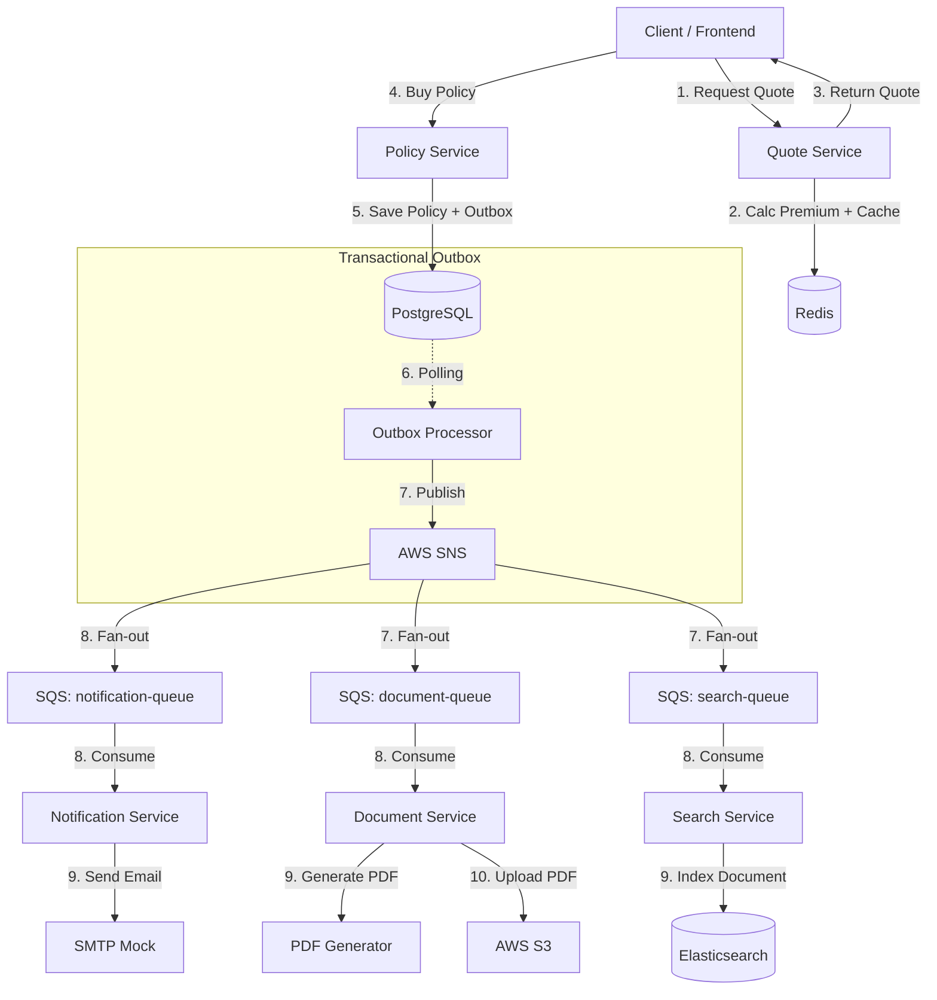

# InsureCloud

Modern, cloud-native Insurance Policy Management Platform built with **Java 21**, **Spring Boot 3.4**, and **AWS** services (emulated via LocalStack).

## 🚀 Overview

InsureCloud is a microservices-based system designed to handle the full lifecycle of insurance policies. It demonstrates professional software engineering practices, including Event-Driven Architecture, Domain-Driven Design (DDD), and Infrastructure as Code (IaC).

## 🛠 Tech Stack

- **Languages:** Java 21 (with **Virtual Threads** enabled)
- **Framework:** Spring Boot 3.4
- **Persistence:** PostgreSQL, DynamoDB, Redis
- **Infrastructure:** Docker Compose, LocalStack (S3, SQS, SNS)
- **API Gateway:** Spring Cloud Gateway (Planned)
- **Search:** Elasticsearch
- **Testing:** JUnit 5, Mockito, Testcontainers
- **API:** OpenAPI (Swagger)

## 🏗 Architecture

The system consists of several autonomous microservices:
- **Policy Service:** Manages policy lifecycle and issuance.
- **Quote Engine:** Calculates premiums based on risk factors.
- **Notification Service:** Handles asynchronous communication with customers.
- **Document Service:** Generates and stores PDF policy documents.
- **Search Service:** Provides high-speed policy searching and analytics using Elasticsearch.

### System Flow Diagram


## 🚦 Getting Started

### Prerequisites
- Docker & Docker Compose
- JDK 21
- Maven 3.9+

### Building the Project
Build all microservices at once from the root directory:
```bash
mvn clean package -DskipTests
```

### Running the Entire System
You can launch the full environment (Infrastructure + Microservices) with a single command:
```bash
docker compose up -d --build
```

This will start:
- **Infrastructure:** LocalStack (S3, SQS, SNS), PostgreSQL, Redis, Elasticsearch.
- **Infrastructure as Code:** A Terraform container automatically initializes all required AWS resources (queues, topics, and buckets) on startup.
- **Microservices:** Policy, Quote, Notification, Document, and Search services.

### Verification
Test the end-to-end flow using the following commands:

1. **Calculate a Quote:**
```bash
curl -X POST http://localhost:8082/api/quotes \
  -H "Content-Type: application/json" \
  -d '{"productCode": "CAR", "customerAge": 25, "assetValue": 50000}'
```

2. **Issue a Policy:**
```bash
curl -X POST http://localhost:8081/api/policies \
  -H "Content-Type: application/json" \
  -d '{"policyNumber": "POL-123", "customerId": "CUST-001", "premiumAmount": 500.00, "startDate": "2026-02-14", "endDate": "2027-02-14"}'
```

3. **Check Search Index:**
```bash
curl http://localhost:8085/api/search/by-number?policyNumber=POL-123
```

## 📈 API Documentation
Once the services are running, you can access the Swagger UI:
- Policy Service: `http://localhost:8081/swagger-ui.html`
- Quote Service: `http://localhost:8082/swagger-ui.html`
- Notification Service: `http://localhost:8083/swagger-ui.html`
- Document Service: `http://localhost:8084/swagger-ui.html`
- Search Service: `http://localhost:8085/swagger-ui.html`

## 📝 License
This project is licensed under the MIT License.
